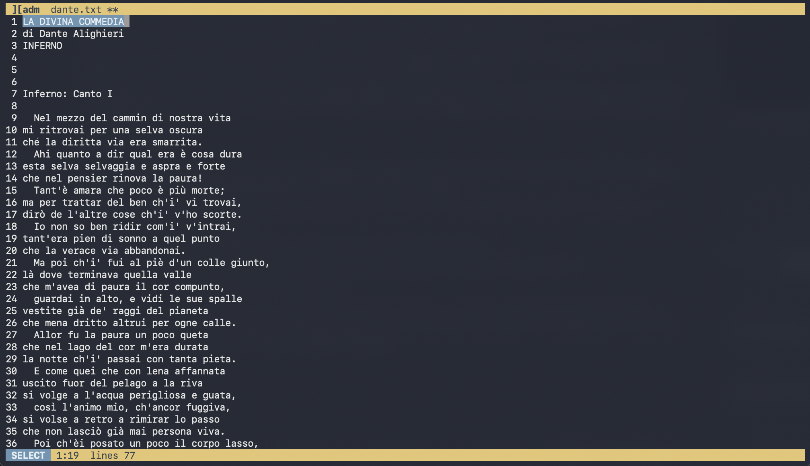

# ][adm

A minimal terminal text editor that does **one** thing, edit text, and does it well.




- **Cross-platform** — POSIX (Linux, macOS, *BSD) and Windows.
- **No dependencies** — only the C standard library and the OS terminal API.
- **Small** — a handful of readable C files.

## Build

```
make
```

Produces the `adm` executable (needs a C11 compiler). Clean with `make clean`.

## Usage

```
adm [file]
```

Opens `file` for editing. If it does not exist yet, the buffer starts empty and
the file is created on save. With no argument you get an empty buffer.


| Key                 | Action                       |
|---------------------|------------------------------|
| Arrows              | Move the cursor              |
| Ctrl-Left / Right   | Move by word                 |
| Ctrl-B              | Selection mode on / off      |
| Esc                 | Cancel the selection         |
| Home                | Start of the line            |
| PgUp / PgDn         | One screen up / down         |
| Backspace / Del     | Delete                       |
| Ctrl-C              | Copy the selection           |
| Ctrl-X              | Cut the selection            |
| Ctrl-V              | Paste                        |
| Ctrl-S              | Save                         |
| Ctrl-Q              | Quit                         |

To select text press Ctrl-B and move the cursor: the movement keys extend the
selection until you copy, cut, type over it, or back out with Esc or Ctrl-B
again. While selection mode is on the bottom bar shows a blue SELECT badge.


The clipboard is the system one. On POSIX it goes through whichever of
`wl-copy`, `xclip`, `xsel` or `pbcopy` is installed, falling back to the
OSC 52 terminal escape (which works over ssh); on Windows it is the native
clipboard. When none of those can be reached the editor still copies and
pastes within itself.
