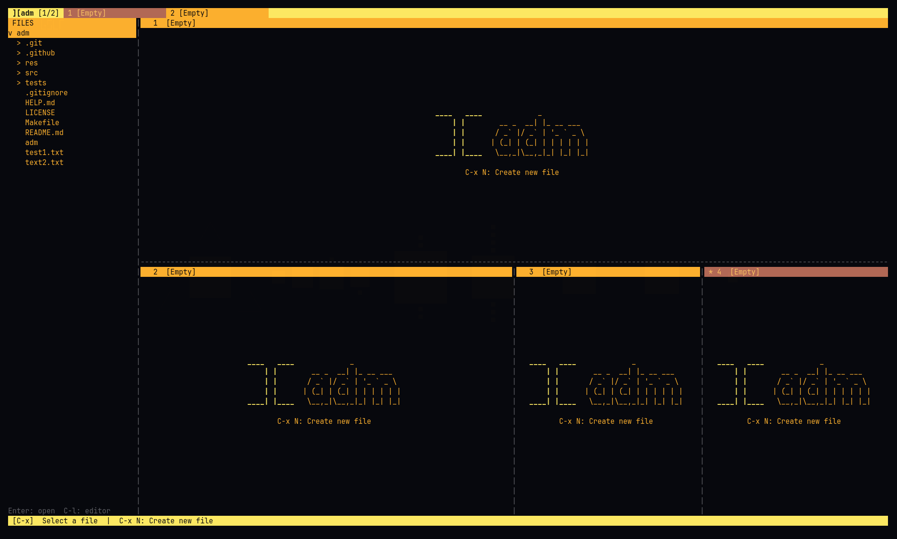

# ][adm

A small terminal text editor for POSIX and Windows, built with C11.



## Overview

- **Emacs inspired controls**
- **Splits**
- **Tabs with independent split layouts**
- **Sidebar**
- **File Explorer**
- **Git Manager**
- **Editing tools**
- **Syntax colours and optional LSP support**
- **Configurable themes**
- **C plugins and User Center**

## Build and run

```sh
make
./adm [file]
make test
```

Requires a C11 compiler and Git 2.23+ for Git features. Tests require Python 3 and Git, using temporary repositories and local remotes; POSIX tests also cover the terminal UI. Clean with `make clean`.

Read the [user guide and keyboard shortcuts](HELP.md) for editor usage.
